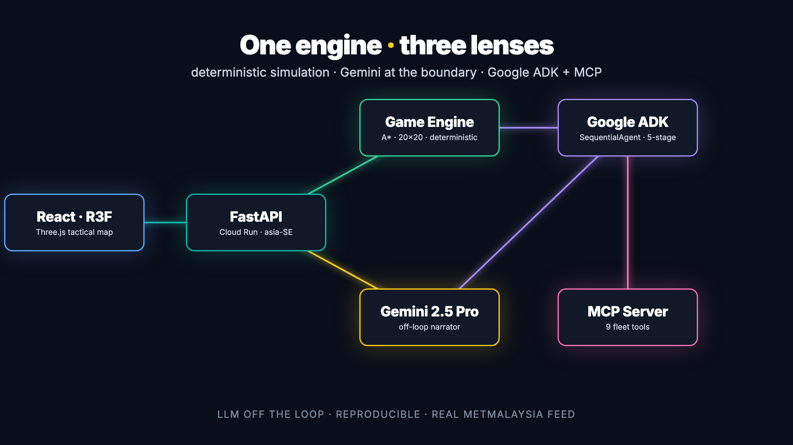
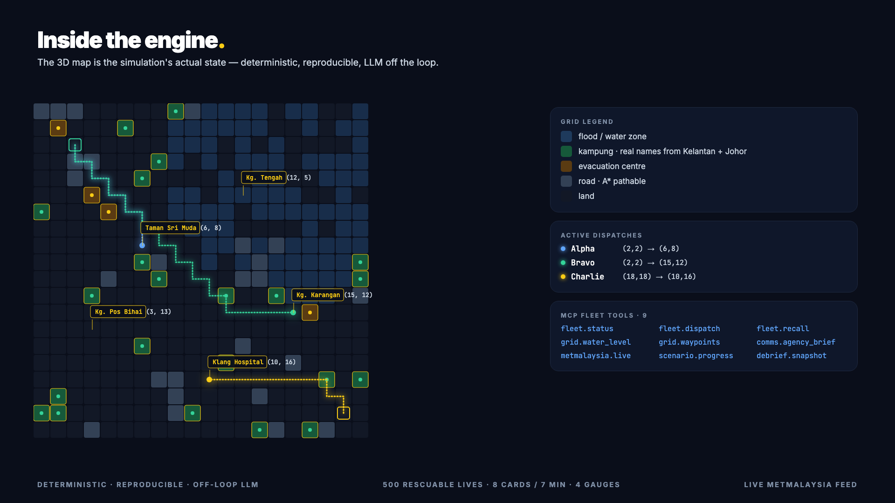
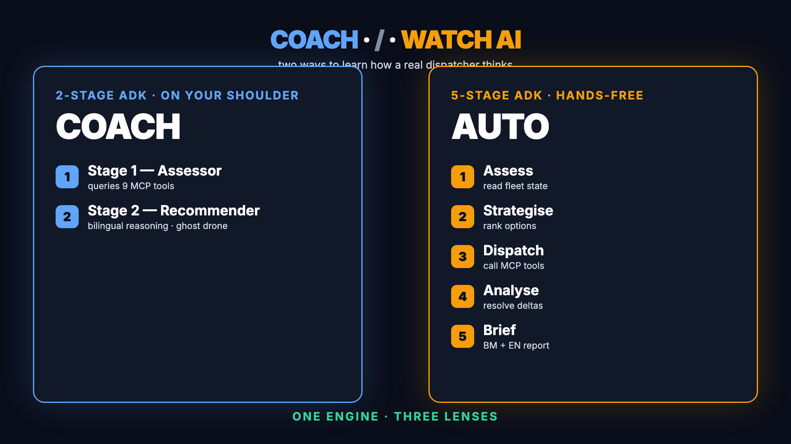
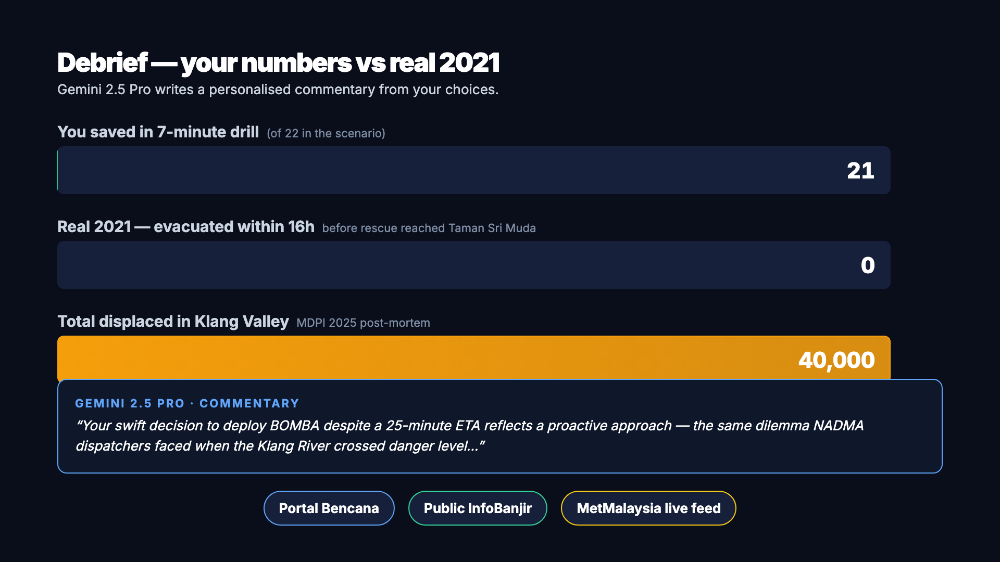
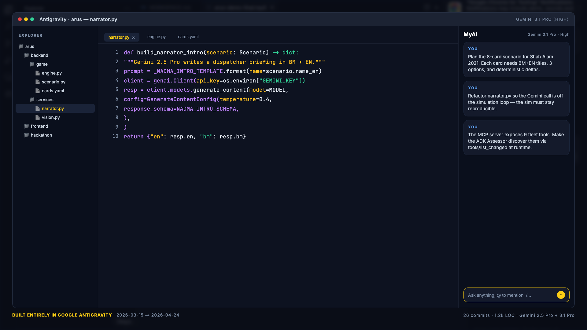

<div align="center">

# Arus — Banjir Drill

### _arus_ (Bahasa Malaysia, n.) — the current of a river; the flow of people, information, and intent.

**When the monsoon drowned Taman Sri Muda in 2021, residents waited 16 hours on rooftops.**
**Arus is a 7-minute three-mode simulator that lets a Malaysian citizen *feel* why —**
**and watch an AI expert think through the same tradeoffs in real time.**

[](https://antigravity.google.com)
[](https://ai.google.dev/)
[](https://ai.google.dev/gemini-api/docs/video)
[](https://google.github.io/adk-docs/)
[](https://modelcontextprotocol.io/)
[](https://cloud.google.com/run)
[](https://api.data.gov.my/weather/warning)

🔴 **Play now** · [`arus-1030181742799.asia-southeast1.run.app`](https://arus-1030181742799.asia-southeast1.run.app)

🎥 [Watch 5-min demo](https://sunflowerslwtech.github.io/arus/video/arus-demo-5min.mp4) · 🖼 [Site](https://sunflowerslwtech.github.io/arus/) · 📊 [Slides](https://sunflowerslwtech.github.io/arus/slides/) · 📘 [Docs](https://sunflowerslwtech.github.io/arus/docs/)

</div>

---

## What this is

**Arus — Banjir Drill** is a browser-playable Malaysian flood-coordination
simulator with **three interactive learning modes**:

- **PLAY** — you are Datuk Nadia, NADMA liaison officer on the night of
  the December 2021 Klang Valley floods. Over 7 minutes you field 8
  incoming calls from BOMBA / APM / MMEA / media / utilities and pick
  between 2-3 response options each.
- **COACH** — same game, with an AI mentor. When a call comes in, a
  2-stage Google ADK agent (Assess → Recommend) streams its reasoning
  live to the right panel, queries the fleet state via 9 MCP tools, and
  paints a **ghost drone** on the map showing the target it would pick.
  Follow or override. The AI speaks BM + EN.
- **AUTO** — the full v1 5-stage ADK pipeline dispatches drones
  autonomously via MCP every 40 seconds. Watch the AI work the problem
  end-to-end across Assessor → Strategist → Dispatcher → Analyst →
  bilingual Agency Dispatcher. No player cards — pure technical demo.

Four gauges move under your decisions:

- **Lives saved** — 0 to target (Hard mode: 14 of 14)
- **Assets** — % of deployable resources left
- **Trust** — % of inter-agency confidence in your chain of command
- **Time** — countdown to cutoff

At the end, you see your grade. Then we show you the **real 2021 Shah
Alam numbers** — 40,000 displaced, 54 deaths, a 16-hour median rescue
wait time, a RM3.7M lawsuit — and a Gemini-authored commentary that
ties your specific choices to the systemic coordination gaps the
[MDPI 2025 post-mortem](https://www.mdpi.com/2073-4441/17/4/513) named.

The point is not to entertain. The point is that public awareness of
coordination difficulty — named in the MDPI paper as a systemic policy
gap — is something citizens can build through **experience, not PDFs**.
Portal Bencana, InfoBanjir and MetMalaysia's warning API are linked at
the end of every session so the citizen carries the lesson into real
preparedness.

## Why citizen-facing

Reference apps in this space are MyJPJ and MySejahtera — **citizen-facing
digital services**. Arus — Banjir Drill is a digital public-education
service that aligns directly with MyDIGITAL's Budget 2026 "Accelerating
Digital Transformation for All" agenda and the six _teras_ of the
Digital Education Policy under Kerajaan Madani. UNICEF Malaysia + MoE +
SEADPRI already deploy paper Disaster Risk Reduction modules in
primary schools; Arus is the digital-native counterpart those modules
need.

## Architecture (v3 — three modes over one simulation engine)

```
┌─────────────────────── Frontend (React 18 + R3F) ────────────────────────┐
│  StartScreen (mode: PLAY | COACH | AUTO)                                 │
│  ┌──────────────┐ ┌────────────────────────┐ ┌──────────────────────┐   │
│  │ AgencyPanel  │ │ 3D TacticalMap         │ │ RightPanel (mode-dep)│   │
│  │ click-to-    │ │ • agency-coloured drones│ │ • NarratorPanel (PLAY)│  │
│  │ dispatch     │ │ • GhostDrones (COACH)  │ │ • CoachConsole (COACH)│  │
│  │              │ │ • busy-status rings    │ │   └ streams live CoT │   │
│  └──────────────┘ └────────────────────────┘ │ • AutoWatcher (AUTO) │   │
│                                               │   └ 5-stage progress │   │
└─────────────────────────────┬─────────────────────────────────────────────┘
                              │ WebSocket /ws/live + REST /api/game/*
┌─────────────────────────────▼─────────────────────────────────────────────┐
│  FastAPI Gateway (Cloud Run asia-southeast1, port 8000)                   │
│  ┌──────────────────┐ ┌─────────────────────┐ ┌──────────────────────┐   │
│  │ GameEngine       │ │ CoachAgent (ADK)    │ │ AutoRunner (ADK)     │   │
│  │ • cards, gauges  │ │ 2-stage: Assess →   │ │ 5-stage: Assess →    │   │
│  │ • scout bonus    │ │   Recommend         │ │   Strategise →       │   │
│  │ • dispatch       │ │ BM/EN JSON output   │ │   Dispatch →         │   │
│  │   degradation    │ │ streams CoT         │ │   Analyse → BM/EN    │   │
│  │ PLAY + COACH     │ │ COACH               │ │ AUTO                 │   │
│  └────────┬─────────┘ └──────────┬──────────┘ └──────────┬───────────┘   │
│           │                      │                       │                │
│           └──────────────────────┴───────────────────────┘                │
│                                  │                                         │
│  ┌───────────────────────────────▼────────────────────────────────────┐  │
│  │  MCP Tool Server (port 8001, same process)                         │  │
│  │   9 tools: discover_fleet · get_drone_status · assign_search_mission│  │
│  │   · assign_scan_mission · recall_drone · get_situation_overview    │  │
│  │   · get_frontier_targets · plan_route · list_detections            │  │
│  │   Dynamic tool discovery via `tools/list_changed` — no hard-coded   │  │
│  │   drone IDs; agents adapt when fleet changes at runtime.           │  │
│  └──────────────────────────────┬──────────────────────────────────────┘  │
│                                 │                                          │
│  ┌──────────────────────────────▼──────────────────────────────────────┐  │
│  │  GridWorld (20×20, Malaysian kampung mapping, A* + power budgets)  │  │
│  └─────────────────────────────────────────────────────────────────────┘  │
└────────────────────────────────────────────────────────────────────────────┘
```

**Why keep the engine deterministic and the agents off-loop**: LLMs in
a 200 ms game tick are a 2024 mistake. In PLAY mode, Arus runs a fully
deterministic game engine with zero latency. Gemini 2.5 Flash writes the
intro and the end-of-game debrief, both off the critical path. In COACH
mode, the 2-stage ADK agent fires once per card (not every tick), so
the player experiences a pause-to-think pattern, not a stutter. In AUTO
mode, the 5-stage pipeline runs at ~40 s cadence by design. The
[CESCG 2025 LIGS paper](https://cescg.org/wp-content/uploads/2025/04/A-Quest-for-Information-Enhancing-Game-Based-Learning-with-LLM-Driven-NPCs-2.pdf)
argues this as the 2026 pattern for LLM-infused games.

**Why MCP matters**: both the COACH agent and the AUTO commander
discover fleet tools at runtime via MCP's `tools/list_changed` signal —
no hard-coded drone IDs. Add a drone mid-mission and both agents adapt
the next cycle. This is a wire-protocol moat — fleet composition can
change at runtime without redeploying the agent.

## Architecture at a glance

The simulation engine is the anchor — deterministic, reproducible,
LLM-off-loop — and six typed component panes hang off it.



## The 3D map is the engine

No decoration: the map is a live render of the `GridWorld` object. Real
kampung names come from [`backend/core/locality.py`](./backend/core/locality.py),
drones move along A* paths computed against the current water mask,
cards dispatch to real grid coordinates.



## The two agents, side-by-side

COACH streams its reasoning on every card and drops a yellow ghost drone
on the map at the suggested coordinate. AUTO takes the wheel entirely
and runs a 5-stage pipeline end-to-end.



## Debrief is not a score screen

Your numbers sit beside real 2021 numbers, Gemini writes a personalised
commentary that quotes your actual choices, and three live links drop the
player into the civic tools they'd use if the water rose tomorrow.



## Built entirely in Google Antigravity

The full build window (2026-03-15 → 2026-04-24) lived inside one
IDE. Gemini 3.1 Pro on the right panel wrote drafts; Gemini 2.5 Pro in
`backend/services/narrator.py` writes the in-app narration.



## 30-second evaluation

**Open the live URL on any phone** and pick a mode. That's the
evaluation.

```
https://arus-1030181742799.asia-southeast1.run.app
```

1. On the Start screen, pick **Play · Coach · or Watch AI** (top row).
   Toggle BM / EN at any time.
2. Tap **Start drill**. Wait ~10 s for the first "Incoming call".
3. **COACH mode only**: watch the right panel fill with the AI's
   streaming reasoning + an MCP `get_situation_overview` tool call,
   then see a yellow ghost drone appear on the map over the suggested
   coordinate and the "🤖 AI suggests" badge light up on an option.
4. **AUTO mode only**: no cards fire. Watch the 5-stage progress bar
   cycle every ~40 s as the commander pipeline assesses, strategises,
   dispatches (via MCP), analyses, and emits a bilingual hand-off.
5. **PLAY / COACH**: field 7 more cards over 7 minutes. Manually
   dispatch idle drones between cards to scout hotspots — each
   confirmed victim gives +1 life (cap +5).
6. Read the debrief: your numbers + Gemini-authored NADMA commentary
   + the real 2021 Klang Valley flood facts that shaped the scenario.

## Design spine (research-backed)

| Pattern | Source | Applied in Arus as |
|---|---|---|
| Card-deck event queue | Reigns (Nerial, 2016) | EventCard + Options, gauges recompute card deck |
| "Game + debrief" beats game alone | JMIR Serious Games 2024 scoping review | 3-section debrief (your results / 2021 reality / links to real civic tools) |
| LLM for writing, deterministic for gameplay | CESCG 2025 LIGS | Gemini narrator off-loop; engine tick is pure code |
| Shareable score | Wordle (NYT) | Planned (Day 3 stretch) |

## Classroom deployment path

Banjir Drill is designed for direct citizen access (B2C).
Teachers who want to embed it as a structured assessment can integrate
via the `GET /api/game/debrief` endpoint, which returns a fully
structured JSON debrief (gauges, grade, choice history, Gemini
commentary in BM + EN, real-event statistics). The payload is
LMS-friendly — assignment launch via query params
(`?session_for=<teacher_id>`) plus score writeback is on the roadmap.

## Quick start (local)

```bash
# 1. Python
python3.13 -m venv .venv
source .venv/bin/activate
pip install -r requirements.txt

# 2. Frontend
cd frontend && npm ci && cd ..

# 3. Configure Gemini key (narrator uses GOOGLE_API_KEY)
cp .env.example .env.local
# Edit .env.local — GOOGLE_API_KEY from https://aistudio.google.com/apikey

# 4. Run backend (no MCP server, no agent dispatch — just game + narrator)
uvicorn backend.main:app --reload --port 8000

# 5. Frontend (separate terminal)
cd frontend && npm run dev
# → http://localhost:5173
```

## Deploy to Cloud Run

```bash
gcloud services enable run.googleapis.com cloudbuild.googleapis.com \
    artifactregistry.googleapis.com generativelanguage.googleapis.com

echo -n "$GOOGLE_API_KEY" | gcloud secrets create arus-gemini-key \
    --data-file=- --replication-policy=automatic

gcloud builds submit --config=cloudbuild.yaml --region=asia-southeast1
```

Live build target: `asia-southeast1` · single instance · `--set-secrets=GOOGLE_API_KEY=arus-gemini-key:latest`.

## Stack

| Tool | Where | Why |
|---|---|---|
| **Google AI Studio** | Prompt design for `narrator.py` + `agents/prompts.yaml` (7 agent stages) | Prompt engineering |
| **Gemini 2.5 Pro** | Narrator intro + debrief (structured BM/EN output) | LLM backbone |
| **Gemini 3.1 Pro (High)** | Antigravity IDE co-pilot throughout development | Code authoring |
| **Gemini 2.5 Pro / Flash preview TTS** | Demo narration (Charon + Kore voices) | Audio synthesis |
| **Veo 3.0 Fast** | Cinematic b-roll for the 5-min demo video (flood aerials, NADMA ops room, BOMBA rescue) | Video synthesis |
| **Google ADK 1.27.1** | `SequentialAgent` / `LlmAgent` orchestration for COACH + AUTO pipelines | Agentic framework |
| **MCP 1.26.0 + fastmcp 3.1.1** | 9-tool fleet server on port 8001, wire-protocol tool discovery | Open protocol |
| **Google Cloud Run** | Deployment (asia-southeast1) | Single-region container target |
| **Google Secret Manager** | `GOOGLE_API_KEY` storage | Standard hygiene |
| **Google Artifact Registry** | Container image registry | Cloud Build target |
| **Remotion 4** | 5-min demo video scene authoring (title cards, architecture, debrief bars) | Programmatic video |
| **Playwright** | Headed browser capture of a full round's gameplay for the demo | Browser recording |

> **AI-assistance disclosure**: Arus — Banjir Drill was built end-to-end
> inside Google Antigravity (2026-03-15 → 2026-04-24) with Gemini 2.5
> Pro (in-app narration), Gemini 3.1 Pro (IDE co-pilot) and Veo 3.0 Fast
> (demo b-roll) assistance. Prompt design iterated in Google AI Studio.

## Project evolution — the three architectures

The repository went through three architectures:

- **v1** — autonomous 5-stage ADK coordinator. Preserved at git tag
  `v1-coordinator`. B2G backend with weak citizen-facing surface.
- **v2** — player-driven card game (Banjir Drill). Citizen-facing
  but the 3D map was decorative and read as a quiz.
- **v3** (current) — the PLAY card loop, plus **COACH** (2-stage ADK
  advisor that streams CoT on every card) and **AUTO** (v1 revived as
  a demo-able technical-depth mode). MCP + ADK brought back, game
  mechanics extended with scout scoring and dispatch-duration
  degradation so the map genuinely matters.

## Roadmap

**v1.0 · now (2026-04-24 release)** — this repo. One scenario,
three modes, bilingual BM/EN, Cloud Run live, MetMalaysia feed,
personalised debrief. Built entirely in Antigravity.

**v1.1 · May 2026** — *hardening + one more scenario.*
- New scenario pack: 2022 Yan floods (Kedah) — different topology, padi
  fields in card bodies. Scenario is a YAML swap, no engine changes.
- Redis session store for concurrent play (Cloud Run single-instance
  limitation lifted).
- COACH-mode telemetry — log whether the recommended option was taken
  vs overridden, grouped by card; measures whether streaming reasoning
  changes decision quality.
- Accessibility audit — screen-reader descriptions on every card, high-
  contrast theme, focus ring polish.

**v1.5 · Q3 2026 · partnership + education**
- Pilot with NADMA / MOE as a pre-monsoon awareness tool in 3 Selangor
  schools. Teacher dashboard: class leaderboard, aggregated debrief
  summaries.
- Multilingual push — Tamil, Mandarin, Iban via Gemini's native
  multilingual TTS and cards translation.
- "Drills that come home" — submission to CESCG '27 describing the
  pattern (deterministic engine + Gemini boundary + ADK agents + MCP
  wire protocol) as a reusable civic-simulation architecture.
- Open-sourcing the `cards.yaml` schema — anyone can author a local
  scenario from a text file.

**v2 · Q4 2026 → Q1 2027 · platform**
- Open MCP tool layer — third parties plug in their own agent fleets
  against the Arus engine. A `locality.py` for Sabah and Sarawak.
- In-browser scenario editor — teachers author their own local drills
  without ever touching YAML.
- Integration with real Portal Bencana + InfoBanjir feeds — live-data
  drills at monsoon peak, not scripted scenarios.
- MMEA buoy integration — real sensor telemetry drives in-session
  water-level calculations for coastal drills.

**v3 · 2027+ · cross-hazard**
- Same engine, different card library: wildfire (Kalimantan
  transboundary haze), earthquake (2015 Ranau), and landslide drills.
- Regional expansion via partnerships with local Disaster Risk
  Reduction NGOs across ASEAN.
- Insurance-industry tie-in (PRUDENTIAL / Etiqa parametric flood
  policies) using session scoring as a preparedness signal.

See the [docs site roadmap](https://sunflowerslwtech.github.io/arus/docs/#roadmap)
for the full technical roadmap with architectural changes per milestone.

## Repo layout (v3)

```
arus/
├── backend/
│   ├── main.py                    FastAPI + WS broadcaster + MCP lifespan
│   ├── core/                      simulation engine (reused across versions)
│   ├── game/
│   │   ├── engine.py              deterministic tick — PLAY + COACH
│   │   ├── scenario.py · cards.yaml · score.py · real_stats.json
│   │   └── agencies.py            UAV ↔ BOMBA/APM/MMEA/NADMA mapping
│   ├── agents/                    v3 — restored from v1-coordinator
│   │   ├── auto_commander.py      5-stage SequentialAgent for AUTO
│   │   ├── auto_runner.py         AutoRunner (MCP + CoT streaming)
│   │   ├── coach.py               2-stage COACH advisor (NEW in v3)
│   │   └── prompts.yaml           5 AUTO stages + 2 COACH stages
│   ├── routes/game.py             POST /api/game/{start,choose,dispatch}
│   └── services/
│       ├── tool_server.py         MCP server on :8001, 9 tools
│       ├── fleet_connector.py     MCP ↔ GridWorld adapter
│       ├── narrator.py            Gemini intro + debrief (off-loop)
│       ├── vision.py · met_feed.py · handoff_log.py
│   └── utils/blackbox.py          CoT capture
├── frontend/src/
│   ├── scene/                     R3F tactical map
│   │   ├── TacticalMap.jsx · FleetRenderer.jsx · TargetingLayer.jsx
│   │   └── GhostDrones.jsx        AI-recommended drone preview (NEW)
│   ├── panels/GlobalStatusBar.jsx
│   ├── components/
│   │   ├── StartScreen.jsx · ModeSelector.jsx (NEW)
│   │   ├── EventCard.jsx · GaugePanel.jsx · AgencyStatusPanel.jsx
│   │   ├── NarratorPanel.jsx · DebriefScreen.jsx
│   │   ├── CoachConsole.jsx       streams CoT + recommendation (NEW)
│   │   ├── AutoWatcher.jsx        5-stage progress + CoT (NEW)
│   │   └── LanguageToggle.jsx · NextCallEta.jsx
│   ├── hooks/                     useWebSocket, useGameApi
│   └── stores/missionStore.js     Zustand
├── cloudbuild.yaml · Dockerfile · requirements.txt
├── docs/slides/ · docs/architecture.svg
└── README.md
```

## License

MIT. See [`LICENSE`](./LICENSE).
