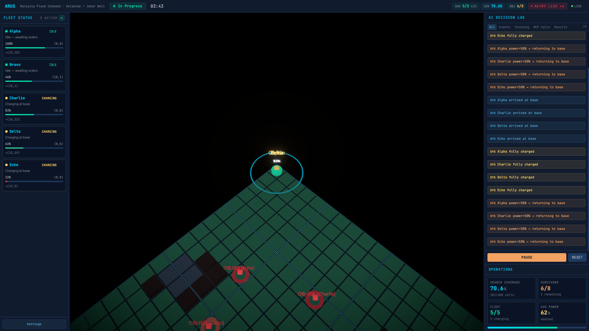
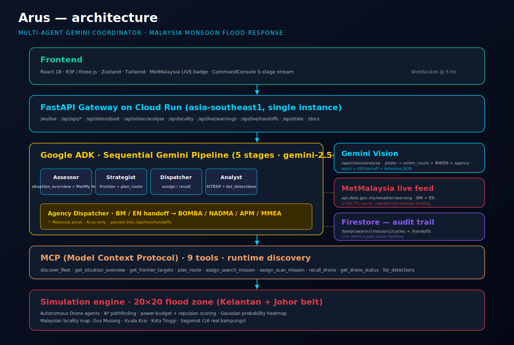

<div align="center">

# Arus

### _arus_ (Bahasa Malaysia, n.) — the current of a river; the flow of people, information, and intent

**When the monsoon drowns a kampung, rescue is a coordination problem — not a courage problem.**
**Arus is the _current_ that moves BOMBA, NADMA, APM and MMEA toward the people who need them, faster than any human dispatcher can.**

[](https://google.github.io/adk-docs/)
[](https://ai.google.dev/)
[](https://cloud.google.com/run)
[](https://firebase.google.com/docs/firestore)
[](https://modelcontextprotocol.io/)
[](https://api.data.gov.my/weather/warning)
[](https://github.com/SunflowersLwtech/arus/actions/workflows/ci.yml)

**Project 2030: MyAI Future Hackathon · Track 2 — Citizens First (GovTech)**

🔴 **Live at** [`arus-1030181742799.asia-southeast1.run.app`](https://arus-1030181742799.asia-southeast1.run.app) · 🎥 [3-min demo](./docs/slides/arus-demo.mp4) · 📊 [15-page deck](./docs/slides/arus-deck.pdf) · 🏗 [architecture](./docs/architecture.svg) · 📈 [impact model](./docs/impact-model.md) · ✅ [proof of life](./docs/proof-of-life.md) · 👨‍⚖️ [for judges](./docs/FOR-JUDGES.md)

</div>



> **Actual output from the 5th-stage agent on production Cloud Run:**
> ```
> AGENSI: BOMBA
> KOORDINAT: (2, 16) — Kg. Kubang Puteh, Kuala Krai, Kelantan
> KEUTAMAAN: TINGGI
> RINGKASAN (BM): Mangsa telah dikesan di Kg. Kubang Puteh, Kuala Krai, Kelantan, memerlukan bantuan segera.
> SUMMARY (EN): A victim has been detected at Kg. Kubang Puteh, Kuala Krai, Kelantan, requiring immediate assistance.
> CADANGAN TINDAKAN / RECOMMENDED ACTION:
>   Hantar pasukan penyelamat untuk penilaian dan tindakan segera.
>   Deploy rescue team for immediate assessment and action.
> ```
> — Not a mock. Get the latest structured bilingual hand-offs directly:
> ```bash
> curl -s https://arus-1030181742799.asia-southeast1.run.app/api/live/handoffs | jq .
> ```

<details><summary>🏗 Architecture diagram</summary>



</details>

---

## Why this exists

> _Every December, Malaysia's agencies tell the same story: the fire brigade
> found the survivor; the coast guard was closer; nobody told the coast guard.
> The survivor drowned anyway._

The Dec 2024 east-coast monsoon displaced **148,024 Malaysians**. BOMBA,
NADMA, APM and MMEA ran the rescue on parallel WhatsApp groups and
hand-transcribed dispatch sheets. Nobody had end-to-end visibility. That is
not a tool problem. That is **a coordination problem no single human
dispatcher can hold in their head** — multiple agencies, overlapping
districts, power-budgeted assets, bilingual briefs, bursty triangulated
calls, all at once.

**Arus replaces the role, not the human.** It is the one component Malaysia
does not yet have: a coordinator that speaks Malay and English at the same
time, reasons over all agencies simultaneously, and makes its decisions
auditable before anyone acts on them.

## How Arus does it

**Arus** is a 5-stage Gemini agent pipeline, deployed on Google
Cloud Run, that watches a live flood-zone grid and continuously:

1. **Assesses** — which assets are available, where is coverage weak
2. **Strategises** — which victims to prioritise given power budgets
3. **Dispatches** — sends assets to targets via MCP tool calls
4. **Analyses** — produces a one-screen situation report
5. **Routes** — emits a bilingual (BM/EN) hand-off brief to the correct
   Malaysian agency (BOMBA / NADMA / APM / MMEA)

Each asset is an **autonomous agent** — it flies, scans, obeys its own
power/safety limits. The Gemini commander does the strategic work humans
are bad at: fleet-wide spatial optimisation, priority reasoning, relay
planning for far corners.

An optional **Gemini Vision endpoint** lets ground teams upload a drone
photo and receive victim count + severity + recommended agency in one call.

## System Architecture

```
┌──────────────────────────────────────────────────────────────────┐
│  Frontend (React 18 + R3F + Zustand)                             │
│  3D tactical map, fleet panel, AI decision log, command console  │
└────────────────────────────┬─────────────────────────────────────┘
                             │ WebSocket (5 Hz state) + REST
┌────────────────────────────▼─────────────────────────────────────┐
│  FastAPI Gateway (Cloud Run, asia-southeast1)                    │
│  • /ws/live  • /api/ops/*  • /api/vision/analyse  • /api/mission │
└────────┬─────────────────────────────────┬───────────────────────┘
         │                                 │
┌────────▼─────────────────┐     ┌─────────▼──────────────────────┐
│  5-Stage Gemini Pipeline │     │  Firestore (audit trail)       │
│  (Google ADK)            │     │  /arus/{mission}/cycles │
│  assess → strat → disp   │     │  /arus/{mission}/handoffs│
│  → analyse → agency      │     └────────────────────────────────┘
└────────┬─────────────────┘
         │ MCP (port 8001)
┌────────▼─────────────────────────────────────────────────────────┐
│  Simulation Engine                                                │
│  20×20 flood zone (Kelantan–Pahang belt) · autonomous drones ·   │
│  A* pathfinding · Gaussian probability heatmap · obstacles        │
└───────────────────────────────────────────────────────────────────┘
```

## Malaysia-specific pivots over generic SAR

| Generic swarm | Arus |
|---|---|
| Abstract "sector NE" | Real Malaysian kampungs (e.g. Kg. Manik Urai, Kg. Laloh) — see `backend/core/locality.py` |
| Single commander | 5-stage pipeline including a **BM/EN Agency Dispatcher** that routes hand-offs to BOMBA / NADMA / APM / MMEA |
| Text dashboards | Gemini Vision endpoint for field-team photo triage |
| Ephemeral state | Firestore mission log — post-event civil-defence reporting |

## AI Tools Used

_(as required by the Project 2030: MyAI Future Hackathon rules)_

| Tool | Where | Why |
|---|---|---|
| **Google AI Studio** | Prompt design & iteration for the 5-stage pipeline | Prompt engineering surface |
| **Google Antigravity** | Final demo / record-of-build | Per hackathon requirement |
| **Gemini 2.5 Flash** | All 5 agent stages + Vision endpoint | Low-latency reasoning at scale |
| **Google ADK** | `SequentialAgent` / `LlmAgent` orchestration | Competition-compliant agent framework |
| **Google Cloud Run** | Deployment (asia-southeast1) | Hackathon-mandated |
| **Firestore** | Mission + handoff persistence | Native Google-stack choice |
| **MCP (Model Context Protocol)** | Agent ↔ fleet tool discovery | Wire-protocol; enables dynamic fleet |

Other (non-AI) libraries: FastAPI, React 18, React Three Fiber, NumPy, SciPy, Zustand, Tailwind. See `requirements.txt` / `frontend/package.json` for exact versions.

> **AI-assistance disclosure:** the scaffold was seeded from the author's
> earlier `SwarmMind` prototype (MCP + ADK architecture). The entire
> Malaysia pivot, 5th-stage agency dispatcher, Gemini Vision endpoint,
> Firestore persistence and Cloud Run deployment were developed during
> the hackathon window inside Antigravity with Gemini assistance.

## 30-second evaluation

Judges — this is the fastest way to verify Arus is real:

```bash
# Exercises every endpoint, waits for one full 5-stage agent cycle, prints a bilingual handoff
./scripts/judge_evaluate.sh

# Or against a custom URL
./scripts/judge_evaluate.sh https://arus-1030181742799.asia-southeast1.run.app
```

Takes ~2 minutes on cold start, ~30 seconds if the instance is warm.

## Quick Start (Local)

```bash
# 1. Install Python deps
python3.13 -m venv .venv
source .venv/bin/activate
pip install -r requirements.txt

# 2. Install frontend deps
cd frontend && npm ci && cd ..

# 3. Configure credentials
cp .env.example .env.local
# Fill in GOOGLE_API_KEY from https://aistudio.google.com/apikey

# 4. Run backend (starts MCP on 8001, API on 8000)
uvicorn backend.main:app --reload --port 8000

# 5. In another terminal: run frontend
cd frontend && npm run dev
# → http://localhost:5173
```

## Deploy to Cloud Run

```bash
# Prereqs: gcloud logged in, project set, APIs enabled
gcloud services enable run.googleapis.com cloudbuild.googleapis.com \
    artifactregistry.googleapis.com firestore.googleapis.com \
    generativelanguage.googleapis.com

# Create Artifact Registry repo (one-time)
gcloud artifacts repositories create arus \
    --repository-format=docker \
    --location=asia-southeast1

# Create Gemini API key secret
echo -n "$GOOGLE_API_KEY" | gcloud secrets create arus-gemini-key \
    --data-file=- --replication-policy=automatic

# Deploy
gcloud builds submit --config=cloudbuild.yaml --region=asia-southeast1
```

## Track Fit: Citizens First (GovTech)

- **Who it serves**: BOMBA / NADMA / APM / MMEA command rooms during an
  active monsoon flood event, plus kampung-level JKKK volunteers.
- **Why GovTech**: multi-agency coordination is one of Kerajaan Madani's
  explicit digital-transformation priorities (cited in `MyDIGITAL`).
- **Scale path**: dashboard is region-agnostic; swap the `locality.py`
  table and the same pipeline covers Sabah/Sarawak river floods or
  peninsula coastal surges.

## Repository Layout

```
arus/
├── backend/
│   ├── main.py                    # FastAPI entry (REST + WS + static hosting)
│   ├── agents/
│   │   ├── commander.py           # 5-stage ADK SequentialAgent
│   │   ├── prompts.yaml           # Malaysia-contextualised prompts (BM+EN)
│   │   └── runner.py              # Pipeline executor + Firestore logging
│   ├── core/
│   │   ├── grid_world.py          # Simulation engine (20x20 flood zone)
│   │   ├── locality.py            # Grid → Malaysian kampung mapping
│   │   └── ...
│   └── services/
│       ├── tool_server.py         # MCP fleet-control tool server
│       ├── vision.py              # Gemini Vision victim-detection endpoint
│       └── firestore_sync.py      # Audit-trail persistence
├── frontend/                       # React + R3F 3D command console
├── Dockerfile                      # Cloud Run multi-stage build
├── cloudbuild.yaml                 # CI pipeline → Cloud Run
└── README.md
```

## Hackathon Submission Checklist

- [x] Deployed on **Google Cloud Run** (asia-southeast1)
- [x] Uses **Gemini 2.5 Flash** via Google ADK
- [x] **Firestore** for persistence
- [x] **MCP** wire protocol
- [x] AI tools disclosed above
- [ ] 3-minute demo video (see `/docs/demo-script.md`)
- [ ] 15-page slide deck (see `/docs/slides.pdf`)

## License

MIT — see LICENSE.
